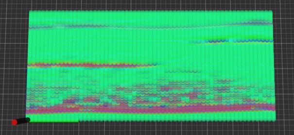
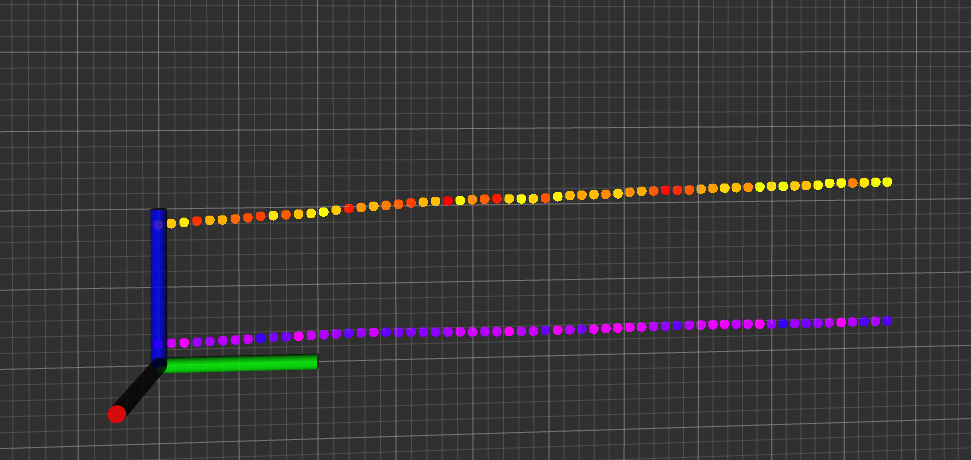
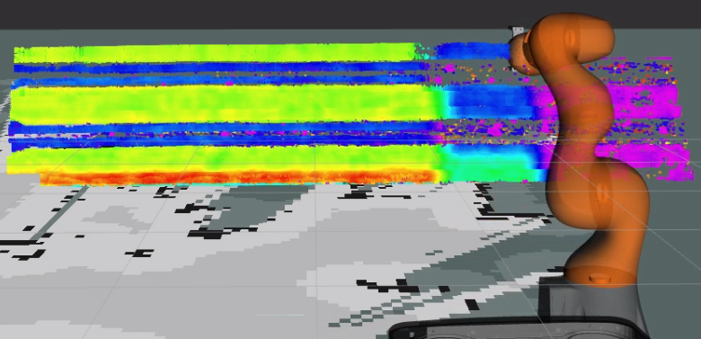
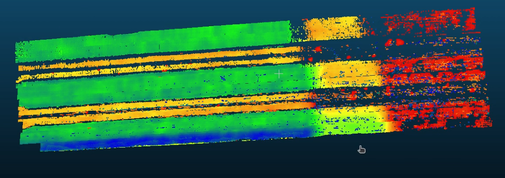

[](https://github.com/MShields1986/peak_ros/actions/workflows/industrial_ci_action.yml)

# peak_ros
ROS driver for use with PEAK MicroPulse devices.


## Quick Start with Docker Compose
```bash
git clone https://github.com/MShields1986/peak_ros.git
cd peak_ros
./run.sh
```

## Installation
This package depends on tf2-sensor-msgs.

```bash
sudo apt update
sudo apt install ros-noetic-tf2-sensor-msgs
cd catkin_ws/src
git clone https://github.com/MShields1986/peak_ros.git
cd ..
catkin build
```

## Usage

```bash
roslaunch peak_ros init.launch
```

Call either of the services `/peak/take_single_measurement` or `/peak/stream_data`.

```bash
rosservice call /peak/take_single_measurement "take_single_measurement: true"
```

...or...

```bash
rosservice call /peak/stream_data "stream_data: true"
```

After this RViz ought to show the current b scan as a pointcloud on `/peak/b_scan`.



If you set appropriate gate parameters in the [config file](src/peak_ros/config/default.yaml) you ought to get a gated b scan as another pointcloud on `/peak/gated_b_scan`, which will depict the front wall, if enabled, and the backwall or any defects.




### Reconstructions in A Fixed External Frame with TF
The [reconstruction configuration parameters](https://github.com/MShields1986/peak_ros/blob/c82a4a9ae57a0f5440fdc98597124bc062844d97/src/peak_ros/config/default.yaml#L43-L47) allow for live reconstruction of the gated ultrasound observations in an external fixed frame.



Furthermore the [export_pcd launch arguement](https://github.com/MShields1986/peak_ros/blob/c82a4a9ae57a0f5440fdc98597124bc062844d97/src/peak_ros/launch/init.launch#L12) allows for the export of the reconstruction to a PCD file for further processing and visualisation in other tools such as [CloudCompare](https://www.danielgm.net/cc/).




### Using Custom MPS files
Currently this driver required MPS files to contain the following directives in order to correctly parse data:
    1. DOF - Needed to determine the resolution and size of the returned data (currently only 1 and 4 are supported)
    2. GATS - Needed to determine the length of each a scan
    3. SWP - Needed to determine the number of focal laws (Note, that only a single sweep is currently supported)

Please ensure that your MPS file contains only one of each of these directives and that it accurately reflects what you are trying to achieve. MPS files ought to be placed in the `src/peak_ros/mps` and then modifiy the [launch file](src/peak_ros/launch/init.launch) `mps_file` launch arguement.

### Streaming Rates
Streaming rates can be set in the [config file](src/peak_ros/config/default.yaml). However, please be aware that your mps file will dictate the upper bound for your streaming rate as the number of focal laws and listening time for each focal law, GATS command, dictates the acquisition time needed by the Peak hardware.

## Bugs and Feature Requests
Please report bugs and request features using the [Issue Tracker](https://github.com/MShields1986/peak_ros/issues).

## Funding
The authors acknowledge the support of:
- RCSRF1920/10/32; Spirit Aerosystems/Royal Academy of Engineering Research Chair “In-process Non-destructive Testing for Aerospace Structures”
- Research Centre for Non-Destructive Evaluation Technology Transfer Project Scheme
