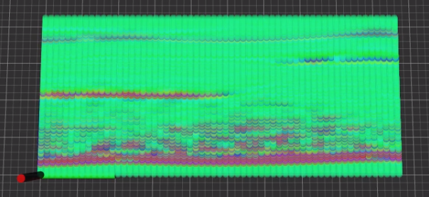
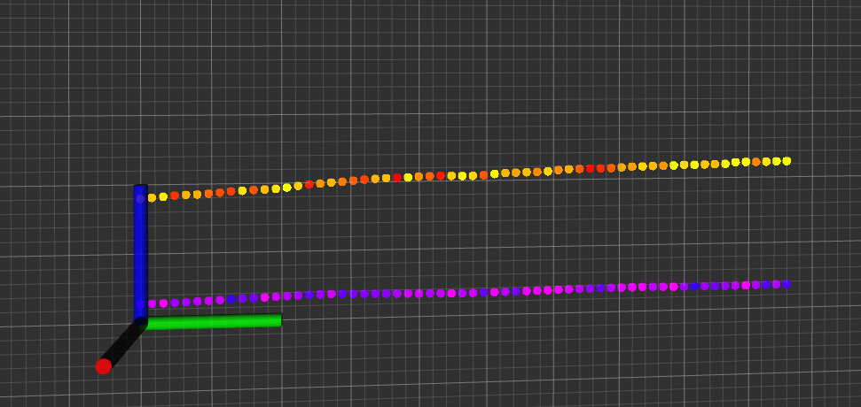

# peak_ros
ROS driver for use with PEAK MicroPulse devices.

## Installation

### Docker
```bash
git clone https://github.com/MShields1986/peak_ros.git
cd peak_ros
./run.sh
```

### ROS Workspace
This package depends on tf2-sensor-msgs. Download the appropriate distribution using the following command:

```bash
sudo apt update
sudo apt install ros-noetic-tf2-sensor-msgs
```

```bash
mkdir -p catkin_ws/src
cd catkin_ws/src
git clone https://github.com/MShields1986/peak_ros.git
cd ..
catkin build
```

## Usage

```bash
roslaunch peak_ltpa init.launch
```

Call either of the services `/peak/take_single_measurement` or `/peak/stream_data`.

```bash
rosservice call /peak/take_single_measurement "take_single_measurement: true"
```

...or...

```bash
rosservice call /peak/stream_data "stream_data: true"
```

After this RViz ought to show the current b scan as a pointcloud on `/peak/b_scan`.




If you set appropriate gate parameters in the [config file](src/peak_ros/config/default.yaml) you ought to get a gated b scan as another pointcloud on `/peak/gated_b_scan`.



### Warning!
Depending on your mps file the reconstruction may not be accurate currently.

TODO: Read the mps file and apply focal laws for reconstruction.

## Bugs and Feature Requests
Please report bugs and request features using the [Issue Tracker](https://github.com/MShields1986/peak_ros/issues).
